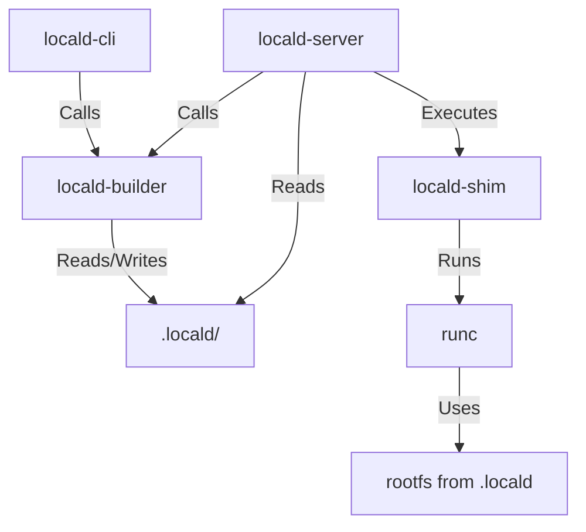

# RFC: CNB Integration Polish

## 1. Summary

This RFC proposes a plan to mature the Cloud Native Buildpacks (CNB) integration in `locald` from a working prototype to a robust, polished feature. It focuses on unifying build logic, enabling incremental builds, fixing cache management issues, and improving the user experience during the build-run cycle.

## 2. Motivation

The current CNB implementation proves that we _can_ build and run projects using standard buildpacks. However, it suffers from several "rough edges" that make it unsuitable for daily use:

1.  **Redundant Rebuilds**: `locald-server` rebuilds the project on every startup, even if the code hasn't changed. This slows down the development loop.
2.  **Cache Corruption**: We currently see "file exists" errors during the restore phase, indicating improper handling of the CNB cache directories.
3.  **Logic Duplication**: Similar build orchestration logic exists in both `locald-cli` (for `locald build`) and `locald-server` (for `locald up`).
4.  **Opaque Process**: When `locald up` triggers a build, the user has little visibility into the process until it fails or succeeds.

We need to align this with our **"Tooling Independence"** axiom: the workspace (and its artifacts) should be the source of truth. `locald build` should produce an artifact that `locald up` simply consumes.

## 3. Detailed Design

### 3.1. Unified Builder Library (`locald-builder`)

We will refactor `locald-builder` to be the single source of truth for all CNB operations. It should expose high-level APIs that both the CLI and Server consume.

**Proposed API Changes:**

```rust
pub struct BuildOptions {
    pub project_path: PathBuf,
    pub builder_image: String,
    pub cache_dir: PathBuf,
    pub output_dir: PathBuf,
    pub force_rebuild: bool,
}

impl Lifecycle {
    /// Checks if a rebuild is necessary based on file changes and artifact presence.
    pub async fn needs_rebuild(&self, options: &BuildOptions) -> Result<bool>;

    /// Runs the build lifecycle, handling cache mounting and error propagation.
    pub async fn build(&self, options: &BuildOptions, progress: impl ProgressListener) -> Result<BuildResult>;
}
```

### 3.2. Incremental Builds & Artifact Reuse

The `locald-server` should not blindly rebuild.

1.  **Artifact Layout**: We will standardize the `.locald` directory structure:

    ```
    .locald/
      artifacts/
        manifest.json  # Contains build metadata (timestamp, builder version, source hash)
        oci-layout/    # The runnable image
      cache/           # CNB cache layers (preserved between builds)
    ```

2.  **Change Detection**:
    - Calculate a hash of the project files (respecting `.gitignore`).
    - Compare with the hash in `manifest.json`.
    - If they match and `oci-layout` exists, skip the build.

### 3.3. Cache Management Fixes

The "file exists" error during restore suggests we are not correctly handling the layer restoration or volume mounting.

- **Strategy**: We must ensure that the `layers` directory is clean before the `restore` phase, or that we are correctly using the CNB lifecycle's expected volume semantics.
- **Action**: Investigate the `creator` invocation. The `creator` binary handles the entire lifecycle. If we are seeing conflicts, it might be because we are reusing a directory that the lifecycle expects to be empty or managed differently. We may need to separate the "cache" volume from the "layers" volume more strictly.

### 3.4. User Experience (UX)

**CLI (`locald build`)**:

- Already works well. Will be updated to use the new `locald-builder` API.
- Should output "Build up to date" if no changes detected.

**Server (`locald up`)**:

- **State**: Introduce a `Building` state for services.
- **Logs**: Stream build logs to the `locald` log stream. The Dashboard and CLI `logs` command should be able to see these.
- **Timeout**: If the build takes too long, it shouldn't block the entire server loop (use `spawn` with a channel for completion).

**Dashboard Integration**:

- **Visual Feedback**: The dashboard must clearly indicate when a service is in the `Building` state.
- **Progress Visibility**: Following the "Respectful & Relevant Output" axiom, the dashboard should show a high-fidelity progress indicator (e.g., "Building: Step 3/5 - Restoring Cache") that "folds away" upon completion, leaving only a success/failure marker in the history.
- **Log Segmentation**: Build logs should be distinct from runtime logs, allowing the user to filter them out or focus on them specifically (e.g., a "Build Logs" tab or toggle).

### 3.5. Architecture



## 4. Implementation Plan (Stage 2)

- [ ] **Refactor `locald-builder`**:
  - Move `run_creator` logic into a robust `Builder` struct.
  - Implement `needs_rebuild` logic (hashing).
- [ ] **Fix Cache Bug**:
  - Create a reproduction case for the "file exists" error.
  - Adjust volume mounts/directory cleaning in `Lifecycle::run_creator`.
- [ ] **Update `locald-cli`**:
  - Use the new `locald-builder` API.
- [ ] **Update `locald-server`**:
  - Remove inline build logic.
  - Call `locald-builder`.
  - Implement the `Building` service state.
  - Stream build logs to the broadcast channel.

## 5. Drawbacks

- **Complexity**: Hashing files for change detection can be expensive for large projects. We might need a fast path (mtime) or use `ignore` crate efficiently.
- **Disk Usage**: Storing cache and artifacts locally increases disk usage per project.

## 6. Alternatives

- **Docker Daemon**: We could just tell Docker to build it.
  - _Why not?_ We want to be daemon-independent and support rootless/daemonless operation eventually. Also, we want fine-grained control over the build process (caching, layers).
- **Always Rebuild**: Keep it simple.
  - _Why not?_ Too slow for "inner loop" development.

## 7. Unresolved Questions

- How do we handle `builder` image updates? If `heroku/builder:22` updates, do we force a rebuild? (Probably yes, check image ID).
- Should `locald build` be required before `locald up`?
  - _Decision_: No. `locald up` should be "batteries included". If artifacts are missing, it builds them.

```

```
